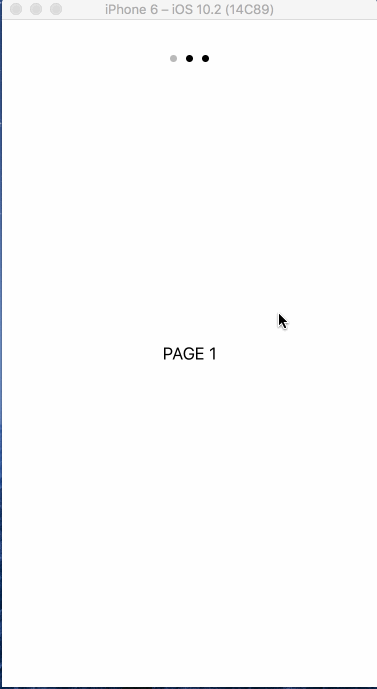

PageViewController
==========

- Setup 3 UIViewController
- Prevent going next if current view is not completed.
- Add custome pageControl

## Screenshots

---
Source

- [How to Use UIPageViewController in Swift](https://spin.atomicobject.com/2015/12/23/swift-uipageviewcontroller-tutorial/)
- [How to Move Page Dots in a UIPageViewController](https://spin.atomicobject.com/2016/02/11/move-uipageviewcontroller-dots/)
